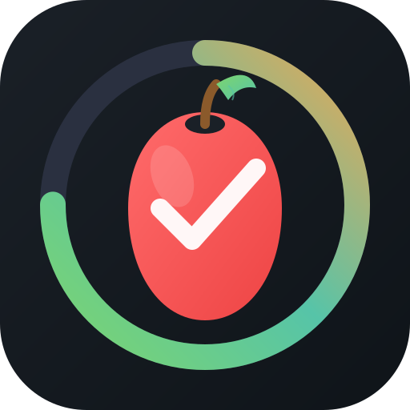

# EasyDiet Tracker

A Progressive Web App (PWA) for tracking daily food consumption with comprehensive nutritional monitoring.



## Features

### 📊 Comprehensive Nutritional Tracking

- **Calorie Ring**: Visual circular progress showing daily calorie consumption vs target
- **Protein Tracker**: Monitor daily protein intake with customizable goals
- **Hydration Tracker**: Track water intake from food contributions (cups)
- **Saturated/Trans Fat**: Warning system for foods with ≥5g saturated/trans fat per serving
- **Fibre Tracker**: Ensure adequate daily fibre intake
- **Added Sugar Tracker**: Monitor added sugar consumption
- **Ultra-Processed Foods**: Track and limit ultra-processed food consumption
- **Salt/Sodium Tracker**: Monitor sodium with min/max target ranges

### 🍎 Food Management

- **Default Food Database**: 70+ food categories organized by food groups, ready to use
- **Searchable Food Database**: 200+ common foods with detailed nutrition data
- **Food Groups**: Fruits, Vegetables, Proteins, Grains, Dairy, Fats, Snacks, Beverages, and more
- **Hand-Based Serving Sizes**: Intuitive portion descriptions (fist, palm, cupped hand, etc.)
- **Recent Foods**: Quick access to recently logged foods
- **Favorite Foods**: Save frequently consumed foods for easy access

### 👆 Intuitive Interactions

- **Tap to Add**: Quick tap on any food icon adds 1 serving
- **Long Press for Precision**: Hold to enter exact serving amounts (supports decimals)
- **Serving Size Display**: See portion size when adjusting servings
- **Scroll Detection**: Prevents accidental taps while scrolling through lists
- **Progress Bar Breakdown**: Tap any tracker to see which foods contributed

### ℹ️ Educational Content

- **Info Buttons**: Learn why each nutrient matters for your health
- **Warning Badges**: Visual alerts for ultra-processed and high-fat foods
- **Nutritional Details**: Complete nutrition facts for every food category

### 🧭 Navigation

- **Sticky Food Group Nav**: Quick jump to any food group
- **Back to Top Button**: Easy return to the tracker dashboard
- **Smooth Scrolling**: Fluid navigation throughout the app

### ⚙️ Customizable Settings

- **Calorie Targets**: Set base calories and activity level bonuses
- **Macro Targets**: Customize goals for protein, carbs, fat, fibre, sugar
- **Water Target**: Set daily hydration goals
- **Salt Range**: Configure minimum and maximum sodium targets
- **Ultra-Processed Limit**: Set maximum daily servings

### 📱 Progressive Web App

- **Offline Support**: Works without internet connection
- **Installable**: Add to home screen on any device
- **Mobile-First Design**: Optimized for touch devices
- **Beautiful Icon**: Custom app icon with calorie ring and apple design

### 💾 Data Persistence

- **Stable Food IDs**: Your logged data persists across app updates
- **IndexedDB Storage**: All data stored locally on your device
- **Cache Management**: Long-press reset clears app cache without losing data
- **Auto-Recovery**: Invalid data is automatically detected and repaired

## Getting Started

### Running Locally

1. **Start a local server** (any of these will work):
   
   ```bash
   # Using Python 3
   python3 -m http.server 8080
   
   # Using Node.js
   npx serve
   
   # Using PHP
   php -S localhost:8080
   ```

2. **Open in browser**: Navigate to `http://localhost:8080`

3. **Start tracking**: The default food database loads automatically!

### Running Tests

1. Open the app in your browser at `http://localhost:8080`
2. Open DevTools Console (Cmd+Option+J on Mac, Ctrl+Shift+J on Windows)
3. Run: `runTests()`

## Usage

### Adding Servings

- **Tap** a food icon to add 1 serving
- **Long press** (hold ~0.5s) to enter a precise amount with serving size displayed

### Viewing Nutrition Info

- Tap the **ℹ** button on any food icon to see complete nutrition facts
- Tap **ℹ** on any tracker bar to learn about that nutrient

### Viewing Breakdowns

- Tap any **progress bar** (protein, water, fat, etc.) to see which foods contributed
- Tap any item in the breakdown to adjust its serving size

### Resetting Daily Counts

- **Tap** the reset button (↻) to clear all servings for today (with confirmation)
- **Long press** the reset button to clear app cache (preserves your data)

### Searching Foods

- Tap the **🔍** search button to find foods from the extended database
- Access **Recent** and **Favorite** foods from the search modal
- Add searched foods to your daily log

### Settings

| Setting | Description |
|---------|-------------|
| Base Calories | Daily calorie target before activity adjustment |
| Activity Level | Low (+0), Moderate (+200), or High (+400) calories |
| Protein Target | Daily protein goal in grams |
| Water Target | Daily hydration goal in cups |
| Carbs Target | Daily carbohydrate goal in grams |
| Fat Target | Daily fat goal in grams |
| Fibre Target | Daily fibre goal in grams |
| Sugar Target | Maximum added sugar in grams |
| Ultra-Processed | Maximum ultra-processed servings |
| Salt Min/Max | Sodium range in mg (default 500-2300mg) |

## Food Data Format

The default database (`default-data.csv`) includes these columns:

| Column | Description | Example |
|--------|-------------|---------|
| Food Group | Category group | "Fruits", "Proteins" |
| Food Category | Specific food | "Berries (strawberries; blueberries)" |
| Servings Low | Minimum recommended | 1 |
| Servings High | Maximum recommended | 3 |
| Serving Size | Portion description | "Cupped hand" |
| Calories | Per serving | 70 |
| Protein | Grams | 1.1 |
| Fibre | Grams | 4 |
| Carbs | Grams | 17 |
| Sugar | Grams | 10 |
| Added Sugar | Grams | 0 |
| Total Fat | Grams | 0.4 |
| Saturated Fat | Grams | 0.3 |
| Trans Fat | Grams | 0.1 |
| Ultra-Processed | true/false | false |
| Hydration | Cups water | 0.7 |
| Salt | Milligrams | 1 |

## Installing as PWA

### iOS (Safari)
1. Tap the Share button
2. Tap "Add to Home Screen"

### Android (Chrome)
1. Tap the menu (⋮)
2. Tap "Install app" or "Add to Home Screen"

### Desktop (Chrome/Edge)
1. Click the install icon in the address bar
2. Or go to Menu → Install EasyDiet Tracker

## Tech Stack

- **HTML5/CSS3/JavaScript** - No frameworks required
- **IndexedDB** - Local data persistence
- **Service Worker** - Offline functionality and caching
- **CSV Parser** - Built-in food database parsing

## Browser Support

- Chrome/Edge 88+
- Safari 14+
- Firefox 78+

## Version History

- **v1.23.x** - Added sweetened yogurts, pastries, breakfast cereals; bug fixes for daily tracking and local time
- **v1.22.x** - Smart food matching: suggest existing food icons for similar searches, added sugar/ultra-processed matching criteria
- **v1.21.x** - Added fried chicken, pita bread, and naan to food database
- **v1.20.x** - Search foods contribute to totals without appearing as icons, editable servings from breakdown
- **v1.19.x** - Comprehensive README update with all features documented
- **v1.18.x** - Stable food IDs, data persistence fixes, validation
- **v1.17.x** - Added banana to tropical fruits
- **v1.16.x** - New app icon, iOS alignment fixes
- **v1.15.x** - Searchable food database, help system, cache improvements
- **v1.14.x** - Navigation improvements, back-to-top button
- **v1.13.x** - Salt/sodium tracking, hydration fixes
- **v1.12.x** - Info buttons, educational content
- **v1.11.x** - Water tracking, confirmation dialogs

## License

MIT License - Feel free to use and modify!
