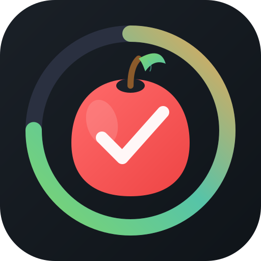

# EasyDiet Tracker

A Progressive Web App (PWA) for tracking daily food consumption by food groups.



## Features

- **Food Tracking by Groups**: Organize and track food consumption by categories and food groups
- **Calorie & Macro Tracking**: Visual dashboard showing calories, protein, carbs, fat, and fibre
- **Tap to Add Servings**: Quick tap increments servings by 1
- **Long Press for Precision**: Enter exact serving amounts to one decimal place
- **Info Tooltips**: Detailed nutrition information for each food category
- **Customizable Goals**: Set base calories and activity-level bonuses
- **Import Food Data**: Load your own food database from XLS/XLSX files
- **Offline Support**: Works without internet connection (PWA)
- **Mobile-First Design**: Optimized for touch devices

## Getting Started

### Running Locally

1. **Start a local server** (any of these will work):
   
   ```bash
   # Using Python 3
   python -m http.server 8080
   
   # Using Node.js
   npx serve
   
   # Using PHP
   php -S localhost:8080
   ```

2. **Open in browser**: Navigate to `http://localhost:8080`

3. **Import food data**: Go to Settings and upload an XLS/XLSX file with your food database

### Sample Data

A sample CSV file (`sample-data.csv`) is included. To use it:

1. Open `sample-data.csv` in Excel or Google Sheets
2. Save as `.xlsx` format
3. Import into the app via Settings

### Food Data Format

Your spreadsheet should have these columns (order doesn't matter):

| Column | Description | Type |
|--------|-------------|------|
| Food Group | Category group (e.g., "Fruits", "Protein") | Text |
| Food Category | Specific food (e.g., "Apples", "Chicken") | Text |
| Servings Low | Minimum recommended servings | Integer |
| Servings High | Maximum recommended servings | Integer |
| Servings Median | Typical recommended servings | Integer |
| Serving Size | Description (e.g., "1 medium apple") | Text |
| Calories | Calories per serving | Number |
| Protein | Grams of protein | Number |
| Fibre | Grams of fibre | Number |
| Carbs | Grams of carbohydrates | Number |
| Sugar | Grams of sugar | Number |
| Total Fat | Grams of fat | Number |

## Usage

### Adding Servings

- **Tap** a food icon to add 1 serving
- **Long press** (hold ~0.5s) to enter a precise amount

### Viewing Nutrition Info

- Tap the **ℹ** button on any food icon to see:
  - Food group
  - Serving size
  - Recommended daily servings
  - Complete nutrition facts

### Resetting Daily Counts

- Tap the **reset button** (↻) in the bottom-right corner to clear all servings for today

### Changing Settings

- **Base Calories**: Your daily calorie target before activity adjustment
- **Activity Level**: 
  - Low: +0 calories
  - Moderate: +200 calories  
  - High: +400 calories
- **Unit System**: Metric or Imperial (for future features)

## Installing as PWA

### iOS (Safari)
1. Tap the Share button
2. Tap "Add to Home Screen"

### Android (Chrome)
1. Tap the menu (⋮)
2. Tap "Install app" or "Add to Home Screen"

### Desktop (Chrome/Edge)
1. Click the install icon in the address bar
2. Or go to Menu → Install EasyDiet Tracker

## Tech Stack

- **HTML5/CSS3/JavaScript** - No frameworks required
- **IndexedDB** - Local data persistence
- **Service Worker** - Offline functionality
- **SheetJS (xlsx)** - Spreadsheet parsing

## Browser Support

- Chrome/Edge 88+
- Safari 14+
- Firefox 78+

## License

MIT License - Feel free to use and modify!
